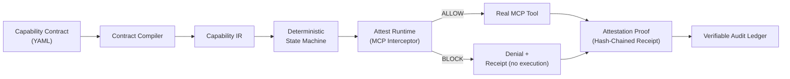
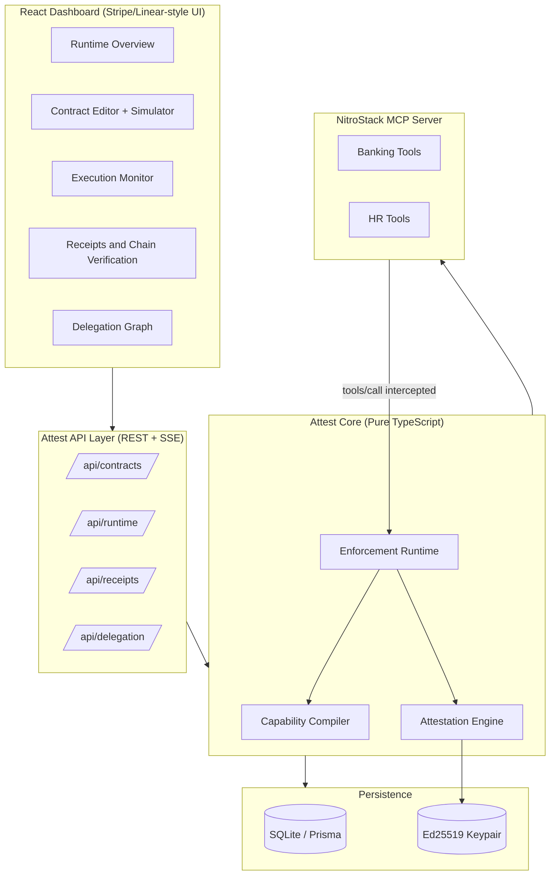
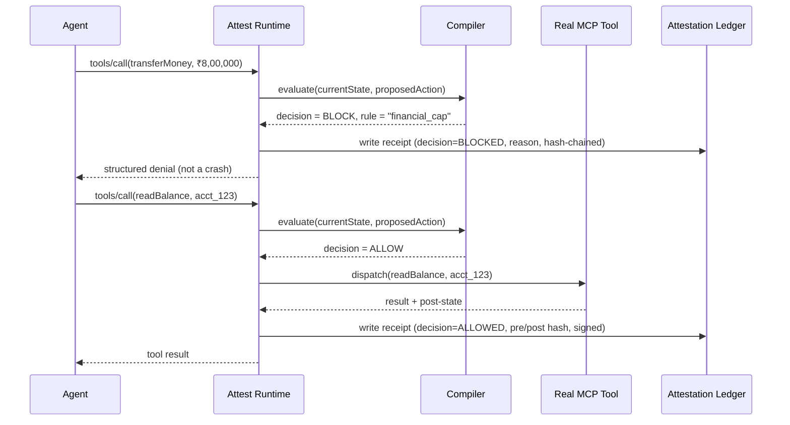
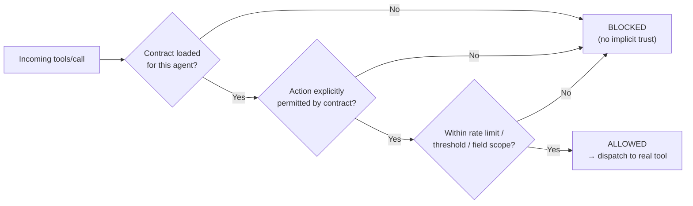
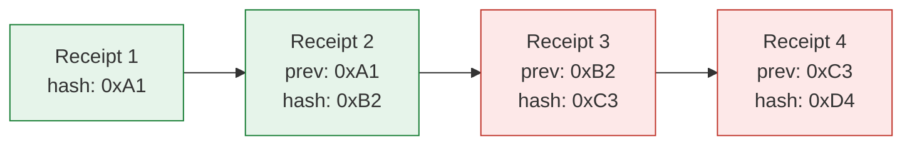
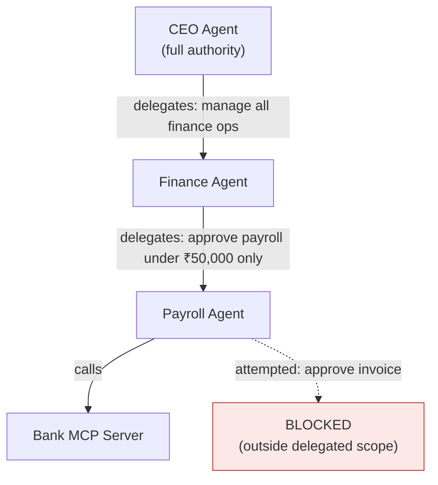
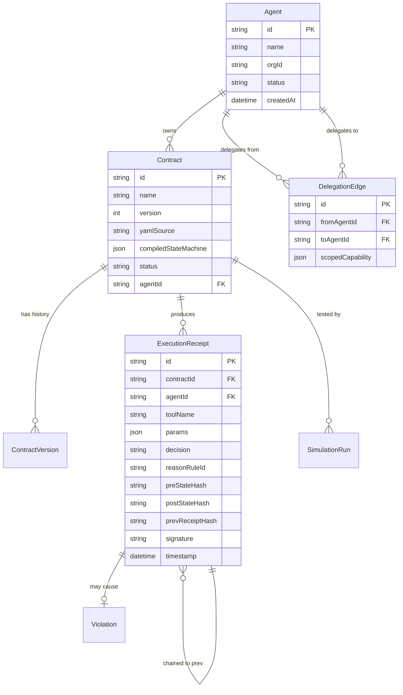
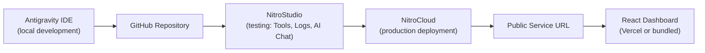

# Attest

### Runtime Enforcement & Cryptographic Proof Layer for AI Agent Capabilities

**Not "prove you were authorized." Prove you mathematically could not have exceeded your authority.**

Built on the Model Context Protocol (MCP) using NitroStack.

---

**Track:** Enterprise AI & Workplace Automation

---

## Table of Contents

1. [Executive Summary](#1-executive-summary)
2. [The Problem](#2-the-problem)
3. [Why This Problem Exists Today](#3-why-this-problem-exists-today)
4. [Existing Solutions and Why They Fall Short](#4-existing-solutions-and-why-they-fall-short)
5. [Solution Overview](#5-solution-overview)
6. [System Architecture](#6-system-architecture)
7. [Complete Runtime Flow](#7-complete-runtime-flow)
8. [The Capability Compiler](#8-the-capability-compiler)
9. [Zero-Trust Enforcement](#9-zero-trust-enforcement)
10. [Cryptographic Attestation](#10-cryptographic-attestation)
11. [Multi-Agent Delegation](#11-multi-agent-delegation)
12. [Why MCP](#12-why-mcp)
13. [NitroStack Integration](#13-nitrostack-integration)
14. [Dashboard Walkthrough](#14-dashboard-walkthrough)
15. [Demo Flow (7 Screens)](#15-demo-flow-7-screens)
16. [Technical Innovations](#16-technical-innovations)
17. [Comparison Matrix](#17-comparison-matrix)
18. [Security Model & Threat Analysis](#18-security-model--threat-analysis)
19. [Tech Stack Rationale](#19-tech-stack-rationale)
20. [Folder Structure](#20-folder-structure)
21. [API Reference](#21-api-reference)
22. [Database Schema](#22-database-schema)
23. [Deployment Architecture](#23-deployment-architecture)
24. [Performance Notes](#24-performance-notes)
25. [Scalability & Production Roadmap](#25-scalability--production-roadmap)
26. [Why This Should Win](#26-why-this-should-win)
27. [Quick Start](#27-quick-start)
28. [License](#28-license)

---

## 1. Executive Summary

**Attest is a runtime enforcement layer that sits between AI agents and the tools they call, guaranteeing — with cryptographic proof — that an agent never exceeded its declared authority.**

Every enterprise building autonomous AI agents today faces the same wall: the agent might work perfectly in a demo, but nobody can *prove* to a compliance officer, a bank regulator, or a hospital auditor that it will only ever do what it's supposed to do. Existing tools check identity (who is calling) and log what happened (after the fact). None of them **structurally prevent** an agent from doing the wrong thing before it happens, and none produce **tamper-evident, cryptographic proof** that it didn't.

Attest compiles a declarative capability contract into a deterministic runtime state machine. Every MCP `tools/call` passes through this state machine before it's allowed to reach the real tool. Violations are blocked, not logged-after-the-fact. Every decision — allow or block — produces a signed, hash-chained receipt, so the entire execution history of an agent is independently verifiable by a third party, offline, without trusting Attest itself.

**Who it's for:** any organization deploying autonomous or semi-autonomous AI agents into regulated or high-stakes environments — banks, hospitals, manufacturing, government — where "the agent behaved" is not an acceptable answer; "here is mathematical proof the agent behaved" is.

---

## 2. The Problem

> Current systems verify **identity**. Nobody verifies **authority during execution**.

Once an AI agent begins running, most organizations cannot answer:

* What authority did it actually have at the moment it acted?
* Did it ever exceed that authority?
* Why was a specific action allowed?
* Why was another action blocked?
* Can we prove the logs were never modified after the fact?

Today, the honest answer to all five questions is: **"we trust that it didn't."** That is not good enough for a wire transfer, a patient record, a factory control system, or a government workflow — and it is the reason autonomous agents remain locked to "human approves every single action," which defeats the point of autonomy.

**Attest exists to turn "we trust it didn't" into "here is cryptographic proof it couldn't have."**

---

## 3. Why This Problem Exists Today

This is not a problem that existed five years ago, because it didn't need to. It exists now because of a specific, recent shift:

* **MCP (Model Context Protocol)**, introduced November 2024, standardized *how* agents call tools — but explicitly left authorization and runtime enforcement **out of scope**, delegating it to implementers who mostly haven't built it.
* **Agent frameworks** — OpenAI Agents SDK, Claude Desktop/Code, Microsoft Copilot, Cursor, Devin — all optimized for *capability* (can the agent do the task) not *governance* (can we prove it stayed in bounds).
* **Enterprises are already deploying agents internally**, but keeping them on a short leash — human-in-the-loop for every action — because no mechanism exists to prove bounded behavior mechanically. This caps the entire value proposition of "autonomous" AI in exactly the industries with the most to gain from it.

In short: **the capability got here before the trust infrastructure did.** Attest is that missing layer, and it's only buildable now because MCP finally gives every tool call a single, typed interception point to instrument.

---

## 4. Existing Solutions and Why They Fall Short

| System                               | What it actually does                    | Why it doesn't solve this                                                                                      |
| ------------------------------------ | ---------------------------------------- | -------------------------------------------------------------------------------------------------------------- |
| **OAuth 2.1 / JWT**                  | Proves identity + scope at grant time    | Nothing stops a valid token from being used outside its intended scope once issued — no runtime boundary       |
| **RBAC / IAM**                       | Coarse-grained role permissions          | Static, not action-aware; doesn't reason about parameters, thresholds, or accumulated state (e.g. rate limits) |
| **API Keys**                         | Authenticates a caller                   | Zero behavioral constraint once authenticated                                                                  |
| **Audit Logs**                       | Records what happened                    | Purely retrospective — forensics, not prevention. Also usually mutable/unverifiable                            |
| **Guardrails (NeMo, Guardrails AI)** | Filters model *output/content*           | Doesn't inspect or block *tool calls*; catches bad text, not unauthorized actions                              |
| **OPA / Cedar (policy engines)**     | Evaluate a request against static policy | Not designed for MCP tool-call interception, no proof-of-compliance artifact, no reversibility/state tracking  |
| **SPIFFE / SPIRE**                   | Proves workload identity                 | Identity, not behavioral compliance — doesn't bound or attest to *what* an authenticated identity actually did |

None of these produce the artifact a regulator actually wants: **a signed, tamper-evident record proving an agent's actions were mechanically constrained to its declared authority, at the moment of execution.**

---

## 5. Solution Overview



The invention is not the cryptography (signatures and hash chains are well-established). The invention is the **compilation step**: a declarative capability grant is compiled into a state machine that sits *before* dispatch and structurally refuses out-of-contract calls — the same way a type system rejects invalid code at compile time rather than crashing at runtime. Enforcement and proof generation are the same event, not two separate systems bolted together.

---

## 6. System Architecture



**Key architectural decision:** Attest is *not* a separate service bolted onto a NitroStack project after the fact — it is built **from** a NitroStack MCP project outward. The compiler, enforcement, and attestation logic live as framework-agnostic TypeScript modules shared by both the MCP tool layer and the thin REST API the dashboard consumes. There is exactly one backend, not two competing ones.

---

## 7. Complete Runtime Flow



Every single tool call — allowed or blocked — produces exactly one receipt. There is no code path where a tool executes without a receipt being written first.

---

## 8. The Capability Compiler

```
Capability Contract (YAML, human-authored/approved)
        │
        ▼
   Zod Schema Validation
        │
        ▼
   Capability IR (Intermediate Representation)
   — ordered, typed predicate list —
   [rate_limit, field_denial, financial_cap, expiry, delegation_scope]
        │
        ▼
   Deterministic Finite-State Machine
   evaluate(state, action) → { decision, matchedRule, reason }
   updateState(state, action) → newState
        │
        ▼
   Runtime Enforcement (pre-dispatch, hard block)
```

Example contract:

```yaml
agent: logistics-partner-agent
allowed_tools: [check_invoice_status, read_shipment]
denied_fields: [customer_ssn, account_balance]
rate_limit: 10/min
financial_threshold: 50000
expires: 24h
non_delegatable: true
```

This compiles into a pure, deterministic function — **no LLM judgment is involved in the enforcement decision.** That's deliberate: a judge, auditor, or regulator can trace the exact rule that fired, every time, with 100% reproducibility.

---

## 9. Zero-Trust Enforcement



Attest defaults to **deny unless explicitly proven allowed** — not "allow unless blocked." An agent with no deployed contract, or a contract that doesn't explicitly cover an action, is blocked by default. This is the same posture as zero-trust networking, applied to agent tool calls.

---

## 10. Cryptographic Attestation



Each receipt contains: `{ contractId, agentId, toolName, params, decision, reasonRuleId, preStateHash, postStateHash, prevReceiptHash, signature, timestamp }`, signed with Ed25519 and linked to the previous receipt's hash — a Merkle/Certificate-Transparency-style chain, not a blockchain (no consensus needed, no external dependency).

**Any tampering with a historical receipt breaks every hash link after it, visibly, and is detectable by any third party offline** — no shared infrastructure, no central authority, no trust in Attest itself required to verify the chain.

---

## 11. Multi-Agent Delegation



A delegated capability can **never exceed** what the delegator itself holds — enforced at compile time by intersecting the child contract's requested capabilities with the parent's granted capabilities. This models how real organizations actually work: authority narrows as it flows down, never widens.

---

## 12. Why MCP

MCP is not incidental to this design — it's the reason this is buildable *now*. Before MCP, every agent framework had its own bespoke tool-calling format, meaning any enforcement layer would need N different integrations. MCP standardized tool calls into a single typed interface (`tools/call`), giving Attest **one universal interception point** that works across any MCP-compliant agent, regardless of which model or lab built it — Claude, GPT, Gemini, or an internal fine-tuned model.

The enforcement model itself is transport-agnostic — if MCP were superseded tomorrow, the same compiler → state machine → attestation pipeline would wrap whatever tool-calling standard replaced it.

---

## 13. NitroStack Integration

Attest is built as a native NitroStack MCP project from the ground up — not an Express app with NitroStack bolted on:

| NitroStack Component              | Role in Attest                                                                                     |
| --------------------------------- | -------------------------------------------------------------------------------------------------- |
| **NitroStack CLI/SDK**            | Project scaffold, `@Tool()` decorators for banking/HR mock tools                                   |
| **NitroStack Core module system** | Application backbone — all modules registered through `app.module.ts`                              |
| **NitroStudio**                   | Manual testing of every tool, live MCP traffic inspection, AI Chat tool-approval flow verification |
| **NitroCloud**                    | Production deployment target, public Service URL for judging                                       |

All enforcement, compilation, and attestation logic lives as pure, portable TypeScript, imported by the NitroStack tool layer — meaning Attest's core engine has zero framework lock-in even though it ships as a NitroStack-native project.

---

## 14. Dashboard Walkthrough

| Page                     | Purpose                                                                                                     |
| ------------------------ | ----------------------------------------------------------------------------------------------------------- |
| **Runtime Overview**     | Answers "is this system trustworthy right now" in 5 seconds — enforcement mode, live counts, emergency stop |
| **Contracts**            | Author, compile, simulate, version, and deploy capability contracts                                         |
| **Execution Monitor**    | Live, terminal-style feed of every enforcement decision as it happens                                       |
| **Receipts & Proofs**    | Invoice-style receipt browser with one-click chain verification                                             |
| **Delegation Graph**     | Visual tree of capability delegation across agents                                                          |
| **Violations**           | Investigation queue for blocked/anomalous executions                                                        |
| **Agents & Connections** | Registered agents and connected MCP tool servers                                                            |
| **Settings**             | RBAC, signing key fingerprint, environment management                                                       |

Design direction: Stripe Dashboard, Linear, Cloudflare Zero Trust. White, dense, no charts for the sake of charts, no decoration — every element earns its place by helping a user **define trust, enforce trust, or prove trust.**

---

## 15. Demo Flow (7 Screens)

1. **Runtime Overview** — "This is already running." Zero-Trust badge, live numbers.
2. **Contract Editor** — Write a YAML contract, watch the Capability Graph compile live.
3. **Simulator** — Run 1,000 scenarios, green pass, deploy.
4. **Execution Monitor** — Agent attempts a blocked ₹8,00,000 transfer — live red entry, inline reason.
5. **Receipt Detail → Verify** — Click verify, chain reports Valid.
6. **Chain Integrity View** — Tamper one historical entry live — chain visibly breaks.
7. **Delegation Graph** — CEO → Finance → Payroll, scopes narrowing, Payroll Agent provably cannot approve a transfer.

Seven screens, zero narration required — the product tells its own story.

---

## 16. Technical Innovations

* **Capability Contract Compiler** — declarative YAML → deterministic, explainable state machine (not an LLM judgment call)
* **Pre-dispatch structural enforcement** — violations never reach the real tool, unlike every logging/guardrail competitor
* **Enforcement-and-proof-as-one-event** — the block/allow decision itself is what gets signed and chained
* **Offline-verifiable hash chain** — no blockchain, no central authority, any third party can verify independently
* **Compile-time delegation intersection** — mathematically guarantees a child agent can never exceed its parent's authority
* **Contract simulation as CI/CD for policy** — test 1,000 scenarios before a contract ever reaches production

---

## 17. Comparison Matrix

| Capability                           | OAuth/JWT |   RBAC  | Guardrails | Audit Logs | SPIFFE/SPIRE | **Attest** |
| ------------------------------------ | :-------: | :-----: | :--------: | :--------: | :----------: | :--------: |
| Identity verification                |     ✅     |    ✅    |      ❌     |      ❌     |       ✅      |      ✅     |
| Pre-execution blocking               |     ❌     | Partial |   Partial  |      ❌     |       ❌      |      ✅     |
| Deterministic, explainable decisions |     ❌     |    ✅    |      ❌     |     N/A    |      N/A     |      ✅     |
| Cryptographic proof of compliance    |     ❌     |    ❌    |      ❌     |      ❌     |       ❌      |      ✅     |
| Tamper-evident history               |     ❌     |    ❌    |      ❌     |      ❌     |       ❌      |      ✅     |
| Delegation-aware scope narrowing     |     ❌     | Partial |      ❌     |      ❌     |       ❌      |      ✅     |
| MCP-native                           |     ❌     |    ❌    |      ❌     |      ❌     |       ❌      |      ✅     |

---

## 18. Security Model & Threat Analysis

| Threat                                                | Mitigation                                                                                        |
| ----------------------------------------------------- | ------------------------------------------------------------------------------------------------- |
| Agent attempts action outside contract                | Blocked pre-dispatch by deterministic state machine, zero-trust default deny                      |
| Agent has no contract at all                          | Blocked by default (fail closed, not fail open)                                                   |
| Historical receipt tampered post-hoc                  | Hash chain breaks visibly at the exact tampered point, detectable offline                         |
| Delegated agent attempts to exceed parent's authority | Blocked at compile time via capability intersection, never reaches runtime                        |
| Compromised signing key                               | Key rotation supported; all receipts signed after rotation are chain-linked to the rotation event |
| Replay of an old allowed action                       | Rate-limit and expiry predicates are stateful and time-bound, not static                          |
| Runtime bypass (direct tool call skipping proxy)      | Enforced structurally — no tool is registered/callable except through the enforcement proxy       |

---

## 19. Tech Stack Rationale

| Layer                                 | Choice                               | Why                                                                                                           |
| ------------------------------------- | ------------------------------------ | ------------------------------------------------------------------------------------------------------------- |
| MCP Server                            | NitroStack SDK                       | Hackathon-mandated, gives standardized tool-call interception point                                           |
| Compiler/Runtime                      | Pure TypeScript, no framework        | Must be portable and framework-agnostic — this is the actual invention, it shouldn't depend on MCP or Express |
| Persistence                           | SQLite + Prisma                      | Zero external dependency for a 48-hour build, production-realistic ORM patterns                               |
| Signing                               | Ed25519 (`@noble/ed25519`)           | Fast, small signatures, industry-standard for this exact use case                                             |
| Frontend                              | React + Vite + TypeScript + Tailwind | Fast iteration, strict typing throughout, matches enterprise dashboard aesthetics                             |
| Diagrams (contract graph, delegation) | React Flow                           | Purpose-built for node/edge visualization, no reinventing graph rendering                                     |
| Code editor (YAML contract)           | Monaco Editor                        | Same editor VS Code uses — familiar, robust                                                                   |
| Live feed                             | Server-Sent Events                   | Simpler than WebSockets for one-directional live streaming, native browser support                            |

---

## 20. Folder Structure

```
attest/
├── src/
│   ├── index.ts                  # NitroStack bootstrap entry
│   ├── app.module.ts             # Root module — registers everything
│   ├── modules/
│   │   ├── banking/
│   │   │   ├── banking.tools.ts
│   │   │   └── banking.resources.ts
│   │   ├── hr/
│   │   │   ├── hr.tools.ts
│   │   │   └── hr.resources.ts
│   │   ├── contracts/
│   │   │   └── contracts.tools.ts
│   │   ├── runtime/
│   │   └── receipts/
│   ├── compiler/                 # Pure TS — framework-agnostic
│   │   ├── contract-schema.ts
│   │   ├── ir-compiler.ts
│   │   ├── state-machine-builder.ts
│   │   ├── simulator.ts
│   │   └── compiler.service.ts
│   ├── enforcement/
│   │   └── runtime-proxy.ts
│   ├── attestation/
│   │   ├── receipt-generator.ts
│   │   └── hash-chain.ts
│   ├── api/                      # Thin REST layer for the dashboard
│   │   ├── contracts.routes.ts
│   │   ├── runtime.routes.ts
│   │   ├── receipts.routes.ts
│   │   └── delegation.routes.ts
│   ├── config/
│   │   ├── database.ts
│   │   └── keys/                 # Ed25519 keypair (gitignored)
│   ├── common/
│   └── widgets/                  # NitroStack-scaffolded (unused by default)
├── frontend/
│   ├── src/
│   │   ├── pages/
│   │   │   ├── RuntimeOverview/
│   │   │   ├── Contracts/
│   │   │   ├── ExecutionMonitor/
│   │   │   ├── Receipts/
│   │   │   ├── Delegation/
│   │   │   ├── Violations/
│   │   │   ├── Agents/
│   │   │   └── Settings/
│   │   ├── components/           # Badge, Table, Card, Modal, Drawer, Toast...
│   │   ├── lib/                  # API client
│   │   └── App.tsx
│   ├── tailwind.config.ts
│   └── package.json
├── prisma/
│   ├── schema.prisma
│   └── seed.ts
├── shared/
│   └── types/
├── package.json
├── tsconfig.json
├── nitro.config.ts
└── README.md
```

---

## 21. API Reference

```
Contracts
  GET    /api/contracts
  GET    /api/contracts/:id
  POST   /api/contracts
  POST   /api/contracts/:id/compile
  POST   /api/contracts/:id/simulate
  POST   /api/contracts/:id/deploy
  GET    /api/contracts/:id/versions
  POST   /api/contracts/:id/rollback/:versionId

Runtime
  GET    /api/runtime/status
  POST   /api/runtime/emergency-stop
  POST   /api/runtime/resume
  GET    /api/runtime/live-feed        (Server-Sent Events)

Receipts
  GET    /api/receipts?contractId=...
  GET    /api/receipts/:id
  GET    /api/receipts/verify/:contractId

Violations
  GET    /api/violations
  POST   /api/violations/:id/suspend-agent
  POST   /api/violations/:id/dismiss

Agents & Delegation
  GET    /api/agents
  GET    /api/agents/:id
  POST   /api/delegation
  GET    /api/delegation/graph
```

---

## 22. Database Schema



---

## 23. Deployment Architecture



---

## 24. Performance Notes

* Contract compilation (YAML → state machine): single-digit milliseconds, no network calls
* Enforcement decision (`evaluate()`): deterministic pure function, sub-millisecond
* Receipt signing (Ed25519): fast, negligible overhead per call
* Hash chain verification: linear in chain length, fully offline, no external dependency

No LLM inference is on the critical enforcement path — this is a deliberate design choice for both speed and auditability.

---

## 25. Scalability & Production Roadmap

**3 months:** real sandbox integrations with banking/healthcare APIs, industry-specific contract templates (SOX, HIPAA, RBI), SSO/RBAC, hosted attestation registry as a paid compliance product.

**1 year:** cross-framework SDK (drop-in shim for LangGraph, CrewAI, OpenAI Agents SDK, non-MCP function-calling interfaces), regulator/auditor partnerships, on-prem deployment for banks and government, formal model-checking of contracts beyond runtime verification.

---

## 26. Why This Should Win

* **Solves a real, current, billion-dollar-adjacent bottleneck** — not a workflow convenience feature. Every enterprise deploying agents hits this wall.
* **Genuine technical depth** — a real compiler, a real deterministic state machine, real cryptographic chaining — not a wrapper around an LLM call.
* **Demoable in 90 seconds with an unmistakable "wow" moment** — the live tamper-and-chain-break.
* **Framework-agnostic core** — the actual invention survives even if MCP itself evolves.
* **Feels like infrastructure, not an application** — the kind of project that could plausibly become a company, not just a hackathon weekend build.

---

## 27. Quick Start

```bash
# Clone
git clone <repo-url> attest
cd attest

# Install
npm install

# Set up database
npx prisma migrate dev --name init
npx prisma db seed

# Run (starts MCP server + API layer)
npm run dev

# In a separate terminal, run the frontend
cd frontend
npm install
npm run dev
```

Open `http://localhost:5173` for the dashboard. The MCP server runs on stdio for NitroStudio connection, and the API layer serves the frontend on its own port (see `.env` for configuration).

**Testing with NitroStudio:** open NitroStudio → Add Server → Nitro Project → select this folder → Studio App Canvas.

**Deployment:** see [Section 23](#23-deployment-architecture) — deploy via NitroStudio's "Deploy" button once linked to a NitroCloud app.

---

## 28. License

MIT — see `LICENSE` for details.

---

<p align="center">Built for the NitroStack × Amrita Agentic AI Hackathon, July 2026.</p>
